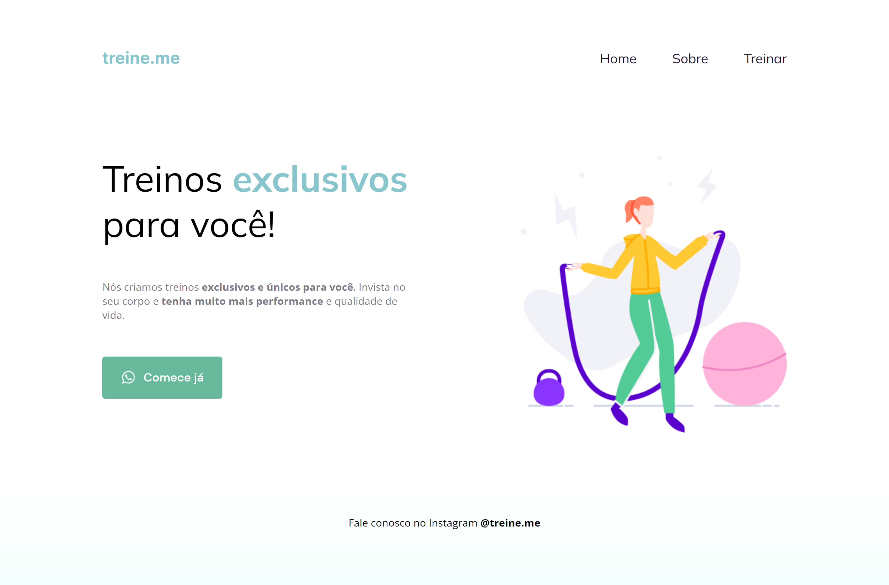

# Explorer Turma 6

> Projeto 02 criado no programa Explorer da RocketSeat

Nesse projeto aprendemos o conceito de flexblox, criar listas, utilizar a ferramenta DevTools para ajustes e controle na criação dos projetos, pseudo-class 'hover' e função linear-gradient()

## Tecnologias
HTML
CSS

## Contato
daniel.aretakis@hotmail.com